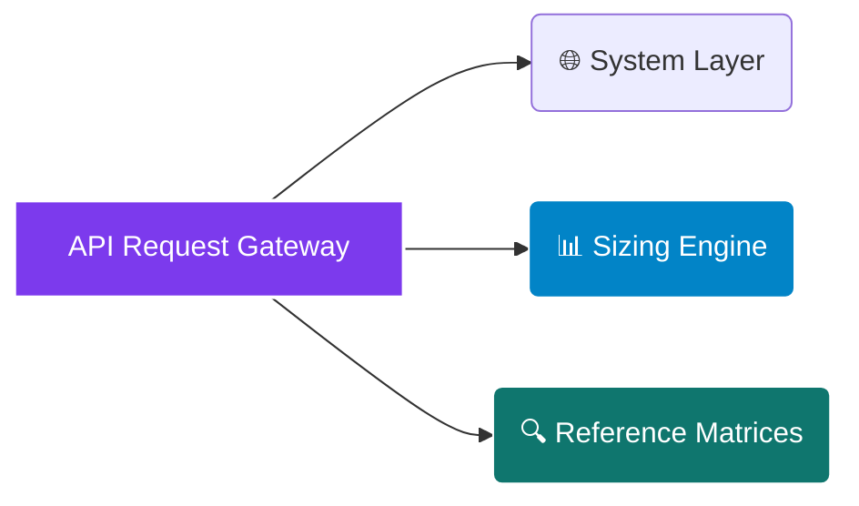

# <p align="center"></p>

<div align="center">

  <p><strong>The Only Lender-Grade EV Fleet Electrification + Co-Located Solar Optimization Engine Purpose-Built for Commercial Property & Logistics Underwriting</strong></p>

</div>

<div align="center">

  <a href="https://rapidapi.com/bethelnedi/api/ev-fleet-electrification-solar-sizing-api"></a>
  <a href="https://elements.stoplight.io/viewer/?spec=https://raw.githubusercontent.com/bethelhash/EV-Fleet-Electrification-Solar-Sizing-API/refs/heads/main/openapi.json"></a>
  
  
  

</div>

---

## ⚡ Executive Summary

The **EV Fleet Electrification & Solar Sizing API (Axiom Core)** replaces highly subjective corporate spreadsheets with standard-aligned, deterministic computational models used by fleet operators, logistics companies, commercial property developers, and institutional underwriters.

By executing high-fidelity vehicle kinematic loading models against multi-tier utility dynamic tariff matrices and behind-the-meter solar envelope physics, the engine delivers comprehensive asset sizing profiles, carbon mitigation parameters, and project financing cash-flow payload matrices in **under 500ms**.

<blockquote align="left">

  <strong>💎 INSTITUTIONAL UNDERWRITING RIGOR</strong><br>

  Engine frameworks are designed to generate investment summaries, cash flows, and debt compliance matrices structured specifically to pass strict institutional risk and credit gates. All parameters trace back to verified statutory references (IRA 2022, Workplace Charging Scheme) and validated empirical databases (NREL, OpenEI, NASA) to completely eliminate black-box computational risks.

</blockquote>

---

## 🏛️ Enterprise Core Capabilities

<table width="100%">
  <tr>
    <td width="50%" valign="top">
      <h3>📈 Advanced Infrastructure Underwriting</h3>
      <ul>
        <li><strong>Asset Cash-Flow Projections:</strong> Compiles complete ASTM-aligned 10-year project underwriting schedules including internal rate of return (IRR), net present value (NPV), and levelized cost of energy (LCOE).</li>
        <li><strong>Sovereign Fiscal Optimization:</strong> Automatically maps tax equity layers, including US Inflation Reduction Act (IRA) §30C, §45W, and §48E structures along with UK Workplace Charging allowances.</li>
        <li><strong>Grid Capacity Stress-Testing:</strong> Simulates multi-vehicle overlapping simultaneous charging patterns to isolate demand spikes and evaluate peak utility tariff impacts.</li>
      </ul>
    </td>
    <td width="50%" valign="top">
      <h3>🔌 Rigorous Vehicle Kinematics &amp; Physics</h3>
      <ul>
        <li><strong>Multi-Class Kinematic Matching:</strong> Processes baseline efficiencies across light, medium, and heavy-duty vehicles (e.g., E-Transit, F-150 Lightning, eCascadia) alongside custom user-defined parameter matrices.</li>
        <li><strong>BTM Solar Balancing:</strong> Computes high-fidelity roof or ground-mount photovoltaic capacity factors required to structurally offset newly injected EV fleet facility loads.</li>
        <li><strong>SAE Standard Charger Profiling:</strong> Integrates specific load curves across SAE J1772 AC Interfaces (Level 1 to 19.2 kW AC), DC Fast Chargers (50–350 kW DC), and Megawatt Charging Systems (MCS).</li>
      </ul>
    </td>
  </tr>
</table>

---

## 🗺️ Market Architecture Hub

### 🌍 Localized Sovereign Jurisdictions
The execution matrix dynamically incorporates country-specific utility baseline structures, local corporate depreciation incentives, environmental frameworks, and tax credits across:
`United States` &middot; `United Kingdom` &middot; `Australia` &middot; `India` &middot; `South Africa` &middot; `Singapore`

### 📊 Validated Fleet Classifications
Vehicle load profiles and statutory credit mappings are automatically validated across a robust asset catalog:
`Light Duty Van` &middot; `Medium Duty Van` &middot; `Light Duty Pickup` &middot; `Medium Duty Truck` &middot; `Class 8 Heavy Duty` &middot; `Custom Vehicle Array`

---

## 📂 API Core Endpoint Directory



---

### 🌐 System Layer

* `GET /health` — Returns engine operational uptime status, cloud proxy status, and version matrices.
* `GET /pricing` — Exposes active subscription tier quotas, programmatic rate latency caps, and overage billing parameters.

### 📊 Sizing Engine

* `POST /fleet/quick` — Fast feasibility screening pipeline. Utilizes minimal input parameters and regional macro assumptions to generate initial payback, consumption baselines, and tax equity snapshots.
* `POST /fleet/full` — Institutional underwriting ledger. Unlocks complete multi-variable fluid asset load analysis, co-located solar optimization balancing, 10-year cash-flow payloads, and regulatory reference maps.

### 🔍 Reference Matrices (JSON Ingestion Loops)

* `GET /reference/vehicles` — Pulls the EPA-validated vehicle registry containing kinematic metrics, efficiency constants ($\text{mi}/\text{kWh}$), and statutory credit allocations.
* `GET /reference/chargers` — Exposes active standard charging profiles matching SAE J1772 and MCS megawatt container coupling configurations.
* `GET /reference/demand-rates` — Direct endpoint stream for dynamic step-change peak utility rate profiles and regional tariff tracking.
* `GET /reference/climate-zones` — Resolves spatial solar performance factors using historical NASA POWER MERRA-2 meteorological database points.
* `GET /reference/incentives` — Generates a compliance matrix mapping regional grant caps, tax equity rules, and demographic bonus criteria.
* `GET /reference/methodology` — Exposes the transparent mathematical equations and verification records behind the core engine calculations.

---

## 📈 Engineering Methodology & Verification Matrix

Every block within the engine is fully traceable and eliminates black-box computing risks by tracking directly to global standards:

| Functional Block | Governing Code / Standard | Enterprise Technical Execution |
| --- | --- | --- |
| **Fleet Energy Consumption** | NREL EVI-Pro / DOE AFDC | Models cumulative annual system consumption baselines ($\text{kWh}/\text{yr}$). |
| **Co-Located Peak Loading** | SAE J1772:2023 Guidelines | Calculates simultaneous vehicle charging overlaps to locate structural facility grid loads ($\text{kW}$). |
| **Utility Tariff Mapping** | OpenEI Utility Rate Database | Traces dynamic changes in seasonal demand structures and peak step-up tariff thresholds. |
| **Photovoltaic Sizing** | NREL PVWatts V8 Engine | Resolves geometric solar envelope outputs to match newly added utility load vectors. |
| **Tax Equity Allocation** | US IRA 2022 (§30C, §45W, §48E) | Automates federal corporate tax balancing, depreciation write-offs, and demographic adders. |
| **Financial Engineering** | ASTM E917 Standard Practice | Computes 10-year project finance indicators (NPV, IRR, LCOE) via a Newton-Raphson loop. |

---

## 🚀 Quickstart Integration Example (Python)

To programmatically run an optimization pass through the enterprise infrastructure gateway, run the configuration script below:

```python
import json
import requests

# Core Routing Configuration via RapidAPI Gateway
GATEWAY_URL = "[https://ev-fleet-electrification-solar-sizing-api.p.rapidapi.com/fleet/quick](https://ev-fleet-electrification-solar-sizing-api.p.rapidapi.com/fleet/quick)"

payload = {
    "country": "united_states",
    "vehicle_class_index": "ford_e_transit_cargo",
    "fleet_size": 25,
    "avg_daily_miles_per_vehicle": 85,
    "charger_type_interface": "level_2_high_output",
    "solar_co_location_target_pct": 50,
    "utility_rate_id": "us_commercial_baseline"
}

headers = {
    "Content-Type": "application/json",
    "X-RapidAPI-Key": "YOUR_SECURE_MARKETPLACE_TOKEN",
    "X-RapidAPI-Host": "ev-fleet-electrification-solar-sizing-api.p.rapidapi.com"
}

response = requests.post(GATEWAY_URL, json=payload, headers=headers)
data = response.json()

print(json.dumps(data["summary"], indent=2))

```

---

## 🔒 Proprietary License & Terms

### Intellectual Property Protection

**Copyright © 2026 Axiom Infrastructure Intelligence LLP. All rights reserved.**

The EV Fleet Electrification & Solar Sizing Engine API, its underlying vehicle kinematic calculation matrices, structural financial modeling loops, OpenAPI directories, interface configurations, and data assets are the exclusive proprietary intellectual property of Axiom Infrastructure Intelligence LLP (Registered LLP, United Kingdom).

No part of this system design, endpoint route hierarchy, code segment, or parameter schema may be reproduced, modified, white-labeled, or reverse-engineered without an active Master Services Agreement (MSA) and express written licensing permission from the corporate rights holder.

### Technical Disclaimer

All outputs generated by the simulation core serve as pre-feasibility infrastructure screens for top-of-funnel scoping. Asset owners must consult with a licensed professional electrical engineer (bound to local codes) and a certified financial advisor before final hardware procurement or infrastructure investment.

```

```
