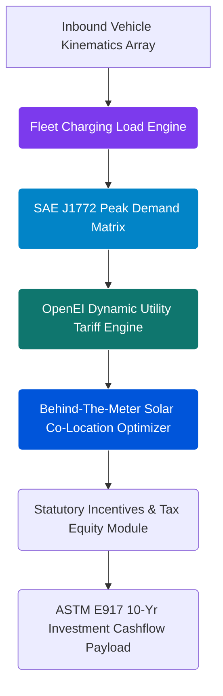

# EV Fleet Electrification & Solar Sizing Engine (Axiom Core)

[](https://rapidapi.com/bethelnedi/api/ev-fleet-electrification-solar-sizing-api)
[](#the-methodology-and-governing-standards)

The definitive, low-latency computational engine for end-to-end commercial fleet electrification, co-located grid-capacity loading, and behind-the-meter solar sizing. Developed by **Axiom Infrastructure Intelligence LLP**, this engine bridges the gap between vehicle kinematics, building envelope logistics, utility demand tariffs, and institutional capital underwriting.

---

## ⚡ Computational Philosophy & System Overview

While standard fleet evaluation software provides basic range estimations, it fails to evaluate the grid impact, thermal boundaries, and structural financial shocks of deploying massive physical electrical loads. Commercial fleet charging transitions present complex structural engineering problems: infusing massive recurring power loads into an asset base can destabilize local power distribution networks, trigger catastrophic spikes in peak facility demand charges, and force premature structural CAPEX overhauls.

This API eliminates spreadsheet uncertainty. By passing a fleet configuration parameter array to a single programmatic endpoint, it processes multi-variable fluid demand profiles, local net-billing tariff rules, cross-border fiscal structures, and localized solar envelope physics to output a complete project underwriting data structure in **under 500ms**.

---

## 🏛️ Core Computational Pipeline Architecture



### Key API Pain Points Solved

* **Elimination of Excel Debt:** Replaces highly subjective, error-prone corporate spreadsheets with standard-aligned, deterministic mathematical models.
* **Underwriting Rigor:** Generates cash-flow summaries, investment profiles, and asset payback schedules structured specifically to pass strict institutional risk and credit gates.
* **Traceable Verification:** Every computed parameter points back to verified statutory text or experimental laboratory datasets via a comprehensive citation register.

---

## 🛠️ Complete Programmatic Execution Matrix

A single call to `POST /fleet/full` calculates and returns **7 complete data sections** along with a transparent reference metadata array:

| Output Payload Structure | Computational Execution | Governing Standards & Foundations |
| --- | --- | --- |
| **Annual Fleet Energy Load** | Calculates the cumulative system charging consumption baseline ($\text{kWh}/\text{yr}$). | **NREL EVI-Pro 2023**; **DOE AFDC 2024** |
| **Co-Located Peak Facility Demand** | Models simultaneous charging event overlaps to determine structural grid loading additions ($\text{kW}$). | **SAE J1772:2023**; Fleet Duty-Cycle Curves |
| **Utility Demand Charge Volatility** | Maps dynamic step-change peak facility demand increases against seasonal utility tariff rules. | **OpenEI Utility Rate Database 2024** |
| **EVSE Structural Asset Sizing** | Computes localized per-unit component hardware procurement and mechanical installation costs. | **NREL/TP-7A40-87610**; **BloombergNEF 2024** |
| **Sovereign Tax Credit Stack** | Models base tax equity allocations alongside geometric demographic adder requirements. | **IRA 2022 §30C, §45W**; **IRS Notices 2023-29/2023-38** |
| **On-Site Photovoltaic Balancing** | Resolves high-fidelity roof yield capabilities required to structurally offset newly added fleet grid loads. | **NREL PVWatts V8**; **NASA POWER MERRA-2 Grid** |
| **Solar Tax Equity Optimization** | Layers base solar investment credits with regional structural, community, and domestic content adders. | **IRA 2022 §48E**; NREL Renewable CAPEX Models |

* **Additional Compiled Outputs:** Integrated managed-charging grid optimization models, 10-year investment cash-flow summaries (NPV, IRR, LCOE via Newton-Raphson), Scope 1 carbon emission offsets, and full regulatory citation maps.

---

## 🌍 Global Sovereign Jurisdictional Compliance

* **🇺🇸 United States:** Full 50-state utility data validation using OpenEI utility records. Automates federal corporate tax optimization under **IRA 2022 §30C** (Alternative Fuel Vehicle Refueling Property), **§45W** (Commercial Clean Vehicle Credit), and **§48E** (Clean Electricity Investment Tax Credit).
* **🇬🇧 United Kingdom:** Maps localized Workplace Charging Scheme (WCS) parameters (covering 75% of physical socket installation caps up to £350 per outlet) combined with Enhanced Capital Allowances (100% first-year capital depreciation structures for zero-emission corporate vehicle classes).
* **🇦🇺 Australia:** Implements ARENA and Clean Energy Finance Corporation (CEFC) commercial electrification framework benchmarks alongside federal Fringe Benefits Tax (FBT) exemptions for qualifying low-emission fleets.
* **🇮🇳 India:** Evaluates regional multi-tier Faster Adoption and Manufacturing of Electric Vehicles (FAME II) commercial subsidies ($\text{₹}10,000\text{--}\text{₹}50,000/\text{kWh}$ across commercial categories).
* **🇿🇦 South Africa & 🇸🇬 Singapore:** Models sovereign industrial peak demand charge structures, localized carbon offset allowances, and regional clean energy development incentives.

---

## 📊 Standard Vehicle Kinematics Core Data

The underlying core engine checks asset calculations against an EPA-validated vehicle database:

| Vehicle Class Index | Structural Category | Kinematic Efficiency ($\text{mi}/\text{kWh}$) | Statutory §45W Credit Allocation |
| --- | --- | --- | --- |
| **Ford E-Transit Cargo** | Light Duty Van | 2.00 | $7,500 Full Credit |
| **Ford E-Transit 350 HD** | Medium Duty Van | 1.60 | $40,000 Full Credit |
| **Ford F-150 Lightning Fleet** | Light Duty Pickup | 2.30 | $7,500 Full Credit |
| **Rivian R1T Fleet** | Light Duty Pickup | 2.30 | $7,500 Full Credit |
| **Workhorse C-1000** | Medium Duty Van | 1.25 | $40,000 Full Credit |
| **Lightning eMotors ZEV3** | Medium Duty Truck | 1.25 | $40,000 Full Credit |
| **Freightliner eCascadia** | Class 8 Heavy Duty | 0.50 | $40,000 Full Credit |
| **Lion8 Electric Truck** | Class 8 Heavy Duty | 0.52 | $40,000 Full Credit |
| **`Custom`** | User-Defined Array | *Dynamic Input* | *Dynamic Ingestion Loop* |

*Source Reference: EPA fuel-economy register (fueleconomy.gov); manufacturer fleet performance catalogues.*

### Supported Charger Infrastructure (SAE J1772:2023)

* **Level 1 Charging Interfaces:** 1.4 kW AC
* **Level 2 Standard Core:** 7.2 kW AC
* **Level 2 High Output:** 11.5 kW AC
* **Level 2 Maximum Outflow:** 19.2 kW AC
* **DC Fast Charging Systems (DCFC):** 50 kW / 150 kW / 350 kW DC
* **Megawatt Charging Systems (MCS):** 500 kW Heavy Duty Container Coupling

---

## ⚙️ Technical Specifications & Interactive Sandbox Tool

This repository provides an automated sandbox configuration. You can test payload queries directly or interface programmatically using our live interactive engine interfaces:

### 🎛️ Interactive API Explorer

Test input variables, review object properties, and perform real-time requests using the embedded Swagger/OpenAPI execution sandbox built directly over the code repository:

* **Launch Interactive Interface:** [amfumu-ev-fleet-api.hf.space](https://www.google.com/search?q=https://amfumu-ev-fleet-api.hf.space)
* **Download Raw OpenAPI JSON Specification:** [openapi.json](https://raw.githubusercontent.com/bethelhash/EV-Fleet-Electrification-Solar-Sizing-API/refs/heads/main/openapi.json)

### Engine Core Endpoints

* **`POST /fleet/quick`** — Fast feasibility screening pipeline. Requires minimal site parameters; relies on regional baseline models.
* **`POST /fleet/full`** — Comprehensive end-to-end physics and financial simulation payload. Connects directly to the co-located solar yield design engine.
* **`GET /reference/methodology`** — Returns full transparent trace mathematical equations, environmental constraints, and underlying source records.

#### Live Reference Dictionaries (All Plans)

* **Vehicles Payload:** `GET /reference/vehicles`
* **Chargers Payload:** `GET /reference/chargers`
* **Demand Rates Payload:** `GET /reference/demand-rates`
* **Climate Zones Payload:** `GET /reference/climate-zones`
* **Incentives Map Payload:** `GET /reference/incentives`

---

## 💎 Production Subscriptions (RapidAPI)

| Tier Classification | Monthly Access Fees | Active Rate Latency Caps | Inclusive Data Volume Quota | Programmatic Endpoint Access | Support Service Level |
| --- | --- | --- | --- | --- | --- |
| **Free Tier Core** | $0 / Month | 5 Requests / Minute | 50 Calls / Month | `/fleet/quick` + Reference Suite | Open Community Forum |
| **Pro Enterprise** | $79 / Month | 1,000 Requests / Hour | Unlimited | Complete Ecosystem Access | Standard Service SLA |
| **Ultra Institutional** | $249 / Month | Uncapped Execution | Unlimited | Full Access + Custom Payloads | Dedicated Engineer Operations |

---

## 🔒 Corporate Charter & Intellectual Property Rights

All core engineering modules, structural load configurations, mathematical calculation frameworks, API endpoints, and OpenAPI data schemas compiled within this repository represent the exclusive proprietary intellectual property of **Axiom Infrastructure Intelligence LLP** (Registered LLP, United Kingdom).

Public API consumption is provisioned exclusively through verified validation layers via RapidAPI. Custom multi-asset portfolio assessments, beige-label engine setups, corporate white-label instances, and formal enterprise SLAs are managed directly by our structural engineering division.

---

## 📌 Technical Domain Metadata Indexation

`ev-fleet-electrification` `solar-sizing-api` `grid-peak-demand` `sae-j1772` `nrel-evi-pro` `utility-demand-charges` `openei-rate-database` `ira-30c` `ira-45w` `solar-co-location` `project-finance-underwriting` `deterministic-energy-math` `fastapi-microservices` `axiom-infrastructure`

---

## 📬 Institutional Interface

* **Production Marketplace Gateway:** [rapidapi.com/user/bethelnedi](https://rapidapi.com/user/bethelnedi)
* **Corporate Engineering Support:** corporate@axiomii.co.uk
* **Core Application Sandbox Support:** support@solartruth.app

```

```
